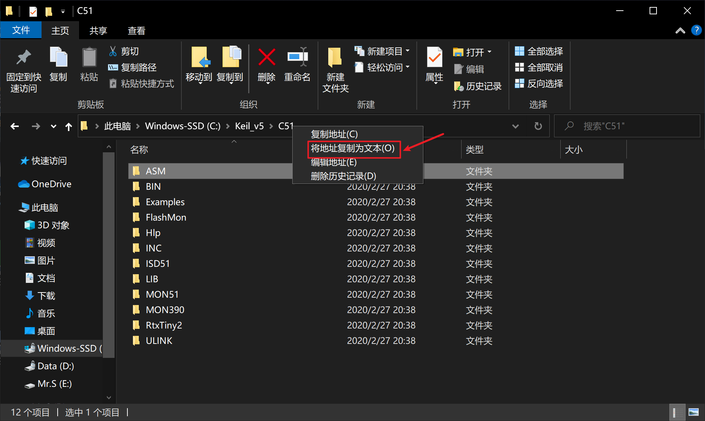
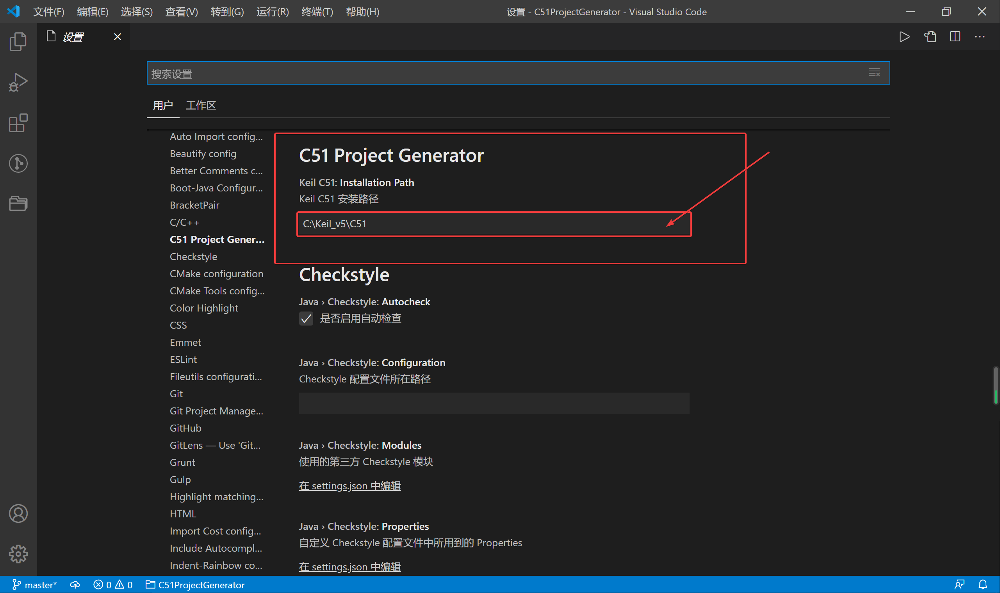

# README
### 希望这个插件能给你一点的帮助，谢谢！
## 使用
#### 这个插件快速生成C51单片机程序项目，依然是使用Keil C51编译器编译。如果的没有安装Keil C51，请先安装。
###
### 如果安装过程中改变了Keil C51的安装路径，请如图操作打开此路径，并将地址复制为文本，然后打开VS Code的设置，在如图的位置粘贴地址

**Thank you!**
